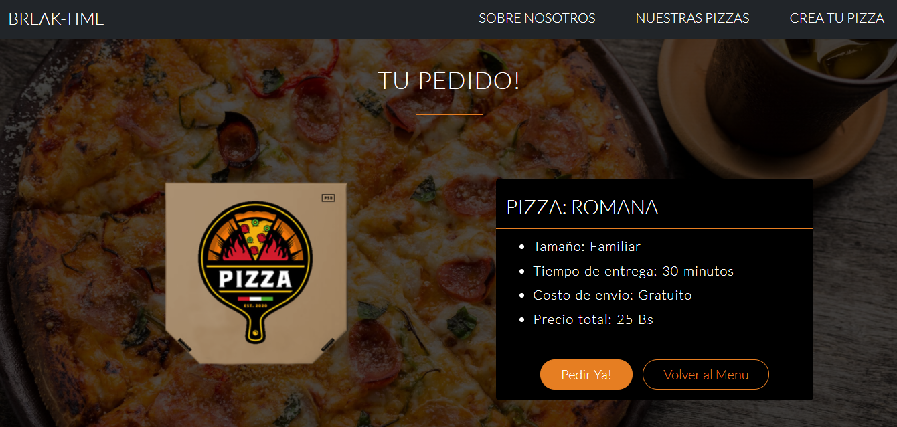
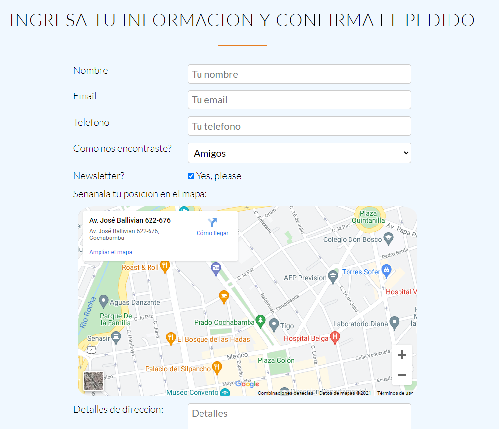

<h1 align="center">Pizza page</h1>

<!-- Status -->

<!-- <h4 align="center"> 
	🚧  CSS Work 🚀 Under construction...  🚧
</h4> 

<hr> -->

<p align="center">
  <a href="#dart-about">About</a> &#xa0; | &#xa0; 
  <a href="#sparkles-features">Features</a> &#xa0; | &#xa0;
  <a href="#rocket-technologies">Technologies</a> &#xa0; | &#xa0;
  <a href="#white_check_mark-requirements">Requirements</a> &#xa0; | &#xa0;
  <a href="#checkered_flag-starting">Starting</a> &#xa0; | &#xa0;
  <a href="https://github.com/{{YOUR_GITHUB_USERNAME}}" target="_blank">Author</a>
</p>

<br>

## :dart: About ##

# Pizza - Page

This is only CSS work. It's the front-end in CSS of a Pizza restaurant


## :sparkles: Features ##

:heavy_check_mark: Menu Page;\
<p align="center">
  
</p>
:heavy_check_mark: Pizza Page;\
<p align="center">
  
</p>
:heavy_check_mark: Form;
<p align="center">
  
</p>

## :rocket: Technologies ##

The following tools were used in this project:

- CSS


## :white_check_mark: Requirements ##

Before starting :checkered_flag:, you need to have [Git](https://git-scm.com) and [Node](https://nodejs.org/en/) installed.

## :checkered_flag: Starting ##

```bash
# Clone this project
$ git clone https://github.com/DussanFreire/pizza-page

# Run the project
Using liver server
```


<a href="#top">Back to top</a>
